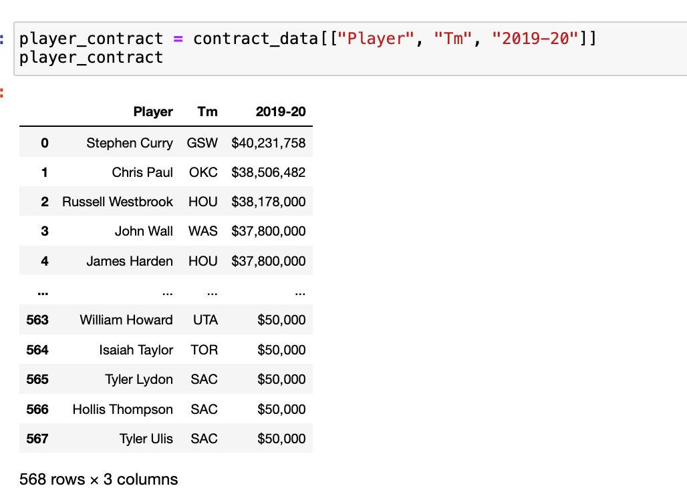
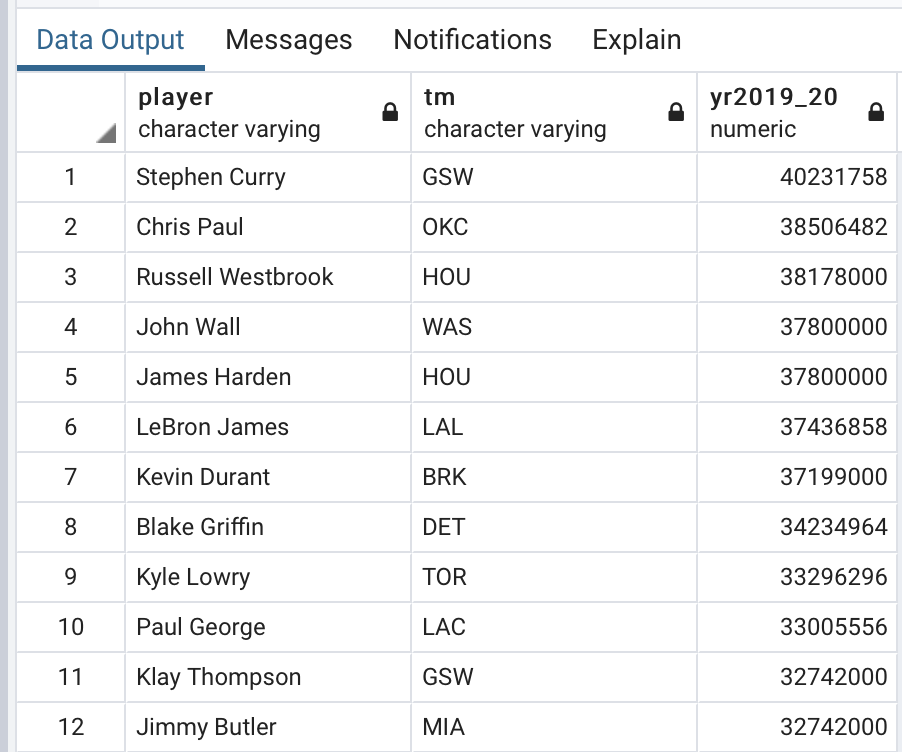
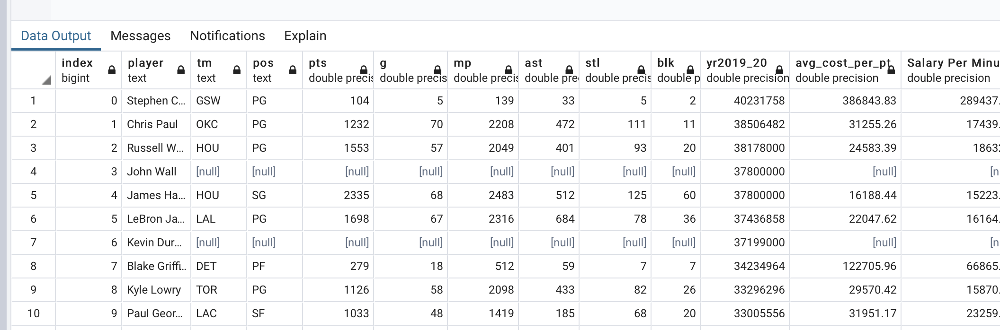

# ETL_project

In this project, we analyzed National Basketball Association ("NBA") players’ 2019-20 salary and average points per game to determine which contracts were overvalued. Note, the NBA salary cap was set at $109.14 million for the 2019-20 season. The salary cap is the limit to the total amount of money teams are allowed to pay their players. The purpose of the cap is to control cost and maintain competitive balance between small and large market teams.  

## Extraction: ##
Two tables were extracted from the [basketball-reference](http://www.basketball-reference.com) webpage; [player stats](https://www.basketball-reference.com/leagues/NBA_2020_totals.html) and [player salaries](https://www.basketball-reference.com/contracts/players.html) for the current (2019-20) basketball season. We saved the data as a csv file in resources as 'player_contracts2019' and 'nba_salaries2019'. Using pandas in python we selected only the columns we needed and saved them as "stat2019_clean.csv" and "salary_clean.csv". In PostgreSQL we created a database "basketball" and created two tables "stats" and "salary". We imported the csv files into the tables. 

## Transformation: ##
The nba_salaries2019.csv file was pulled into a dataframe ("contract_data") and all columns were removed except: Player, Team, and Salary (see csv file "Salary_clean" in the Resources folder). We pulled the player_stats.csv file into a dataframe ("player_data") (see csv file "stat2019_clean" in the Resources folder). 

Using postgressql, "salary_clean" and "player_data" were merged into a single dataframe ("nba_sal") with the columns: Player, Team, Position, and Salary. In some cases, players appeared on duplicate rows as a result of being traded during the season. Only the first instance of each player was kept because salary data remained constant across duplicate instances. The first instance was sufficient for the analysis and renamed as dataframe "nba_sal_clean".
